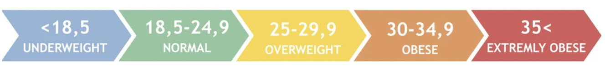
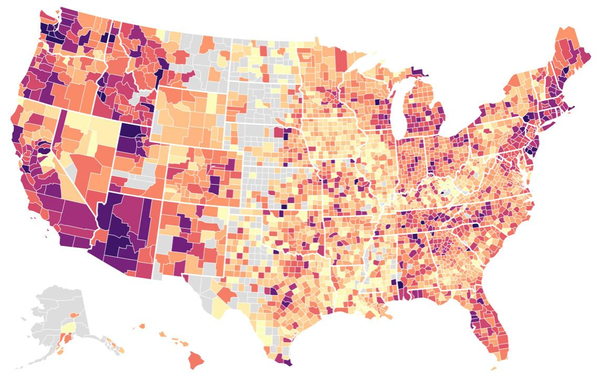

<br>

<html>
<head>
    <style type="text/css">
    
     h5{
  font-size: 1.5em;
  border: 2px solid #6495ED;
  color:#F8F8FF;
  background: #6495ED;
  border-radius: 30px;
  text-align: center;
}

    </style>
</head>
</html>

# 1 | Introduction 

Healthcare in the United States is organized in a complex bureaucracy. While in the rest of the world healthcare facilities are owned mostly by governments or by private sector businesses, in the US a large share of hospitals and clinics are owned by private non-profit organizations.


Yet, the United States is the country that has the highest healthcare expenditures in the world. While these expenditures are covered in a large share by public payers as by Federal institutions, or State and local governments, they can also be covered by private insurance and individual payments.


At the same time, unlike most developed nations, the US health system does not provide health care to its entire population. As there is no single nationwide system of health insurance, the United States primarily relies on employers who voluntarily provide health insurance coverage to their employees and dependents.


In addition, the government has programs that tend to cover healthcare expenses for the fragile parts of the society as the elderly, disabled and the poor. These programs differ from one another, and all have a specific kind of people that are subject to.


Getting health insurance in the US is not an easy thing. Someone may think that once you have money everything is easy peasy, but in fact things are a bit more complicated. One must be very careful and look out to pick the right insurance.

<br>


*Context (emerge from understanding who we are working with and why they are doing what they are doing):*


the insurer wants to develop the best medical insurance products, plan a particular insurance outcome, or manage a big portfolios. For all these cases, the objective is to accurately predict insurance costs.

*Explanation of the variables of the dataset :*


- age: age of primary beneficiary

- sex: insurance contractor gender, female, male

- bmi: Body mass index, providing an understanding of body, weights that are relatively high or low relative to height, objective index of body weight(kg/m^2) using the ratio of height to weight, ideally 18.5 to 24.9

- children: Number of children covered by health insurance / Number of dependents

- smoker: Smoking

- region: the beneficiary's residential area in the US, northeast, southeast, southwest, northwest.

- charges: Individual medical costs billed by health insurance


```{r,echo=FALSE,message=FALSE,warning=FALSE}
library(readr)
library(ggplot2)
library(DT)
insurance <- read_csv("insurance.csv")
```

<br> 

__Insurance Data__

```{r,echo=FALSE,warning=FALSE}
datatable(insurance, options = list(pageLength = 5))
```

## 2 | Exploratory Data Analysis {.tabset .tabset-fade }

### Does Smoking Have a Price ? {.tabset .tabset-fade .tabset-pills }

##### Does Smoking Have a Price ? 
<br>

Smoking and health insurance don’t exactly go hand-in-hand. But understanding how one relates to the other will help you identify how tobacco use can affect your finances. You’re probably curious how smoking can affect the cost of medical coverage. You might also be wondering how insurance companies determine health insurance rates for smokers. 

Under the Affordable Care Act (ACA), health insurance premiums are based on the following factors: plan category, the number of individuals on the policy, age, location, and tobacco use. Many insurance companies can factor in tobacco use in order to increase health insurance rates for smokers. 

The practice of charging tobacco users more is called tobacco rating. The ACA allows for insurance companies to charge smokers up to 50% more (or premiums that are 1.5 times higher) than non-smokers through a tobacco surcharge.4,5 Although this is allowed, it doesn’t mean that all states have decided to implement this charge. As demonstrated below, tobacco surcharges can vary from state to state.

#### Smoking Cost

```{r, echo=FALSE, message=FALSE,warning=FALSE}
library(plotly)


plot_ly(alpha = 0.3) %>% 
  add_histogram(data= insurance[insurance$smoker == 'yes',], x = ~charges, xaxis = "x1", color =~smoker) %>% 
  add_histogram(data= insurance[insurance$smoker == 'no',], x = ~charges, xaxis="x2", color= ~smoker) %>%
  layout(margin = list(t = 60),
    title = "Insurance Cost and Smoking",
    xaxis = list(
      side = "left",
      title = "Insurance Cost"
    ),
    xaxis2 = list(
      overlaying = "x",
      position = 0.95
    ),
    yaxis = list(title = "Count")
  )
```

#### Smoking Cost Violin Plot

```{r, echo=FALSE, message=FALSE,warning=FALSE}

fig <- plot_ly(data = insurance, x = ~smoker, y = ~charges,type = 'violin')

fig <- fig %>%
  layout(
    yaxis = list(
      title = "",
      zeroline = F
    )
  )

fig
```

#### B.M.I and Charges

```{r, echo=FALSE, message=FALSE,warning=FALSE}

fig <- plot_ly(data = insurance, x = ~bmi, y = ~charges, color = ~smoker)

fig
```

#### Age and Charges 

```{r,echo=FALSE,message=FALSE,warning=FALSE}

fig <- plot_ly(data = insurance, x = ~age, y = ~charges, color = ~smoker)

fig
```

<br>

### Does B.M.I Play a Factor ? {.tabset .tabset-fade .tabset-pills }

##### Does B.M.I Play a Factor ?



The Affordable Care Act changed the health insurance industry. According to the act, insurers cannot charge higher health insurance premiums to people with pre-existing medical conditions. Unfortunately, obesity is not considered a pre-existing condition, so insurers can charge higher premiums when providing health insurance for obese people. Generally, people with a body mass index (BMI) of 30 or higher can expect to pay more each month for health insurance. In some cases, health insurance for obese people costs 25 to 50 percent more than coverage for people with a BMI below 30. 


#### BMI and Charges

IDK Yet

#### Age and Charges 

```{r,echo=FALSE,message=FALSE,warning=FALSE}
fig <- plot_ly(data = insurance, x = ~age, y = ~charges, color = ~bmi)
fig
```


### What Region Cost Most ? {.tabset .tabset-fade .tabset-pills }

##### What Region Cost Most ?

Health care spending per capita varies by state. The aforementioned two factors, the price of services and the amount the services are used, also affect the average health care spending in each state. Some states have significantly lower prices for seeing a doctor or specialist than other states. Additionally, some states have a higher population of people over 65, also increasing the average costs.



#### Age Distribution

```{r, echo=FALSE, message=FALSE,warning=FALSE}
fig <- plot_ly(data = insurance,x= ~age,type = "histogram")
fig
```

#### Region and Cost Violin Pot

```{r, echo=FALSE, message=FALSE,warning=FALSE}
fig <- plot_ly(data = insurance, x = ~region, y = ~charges,type = 'violin')
fig
```

#### Region and Cost Histogram

```{r, echo=FALSE, message=FALSE,warning=FALSE}
fig <- plot_ly(data = insurance, x = ~region, y = ~charges)
fig
```

#### I

```{r, echo=FALSE, message=FALSE,warning=FALSE}
fig <- plot_ly(data = insurance,x= ~region,type = "histogram", color= ~region)
fig
```

#### II

```{r, echo=FALSE, message=FALSE,warning=FALSE}
fig <- plot_ly(data = insurance,x= ~region,type = "histogram", color= ~smoker)
fig
```

#### III

```{r, echo=FALSE, message=FALSE,warning=FALSE}
fig <- plot_ly(data = insurance,x= ~region,type = "histogram", color= ~sex)
fig
```

### Which Gender Costs More ? {.tabset .tabset-fade .tabset-pills }

##### Which Gender Costs More ?

#### Cost and Gender

```{r, echo=FALSE, message=FALSE,warning=FALSE}
plot_ly(alpha = 0.3) %>% 
  add_histogram(data= insurance[insurance$sex == 'male',], x = ~charges, xaxis = "x1", color =~sex) %>% 
  add_histogram(data= insurance[insurance$sex == 'female',], x = ~charges,xaxis="x2", color= ~sex) %>%
  layout(
    margin = list(t = 60),
    title = "Insurance Cost and Gender",
    xaxis = list(
      side = "left",
      title = "Insurance Cost"
    ),
    xaxis2 = list(
      overlaying = "x",
      position = 0.95
    ),
    yaxis = list(title = "Count")
  )
```

# 3 | Feature Engineering

```{r}

```


```{r}

```


```{r}

```


```{r}

```


```{r}

```


```{r}

```


```{r}

```


```{r}

```


```{r}

```

